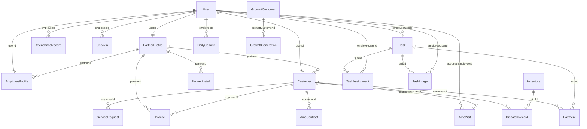

# SWAYOG Energy Dashboard - Unified Technical Specifications Document
## Project: SWAYOG Energy Management Platform

**Version:** 1.0  
**Date:** June 8, 2026  
**Status:** Unified Reference  

---

## 📑 Table of Contents
1. [Introduction and System Scope (SRS)](#1-introduction-and-system-scope-srs)
2. [Prisma Database Schema Reference (PostgreSQL)](#2-prisma-database-schema-reference-postgresql)
3. [Page-by-Page Web Portal Specifications](#3-page-by-page-web-portal-specifications)
4. [Customer & Partner Mobile Applications Reference](#4-customer--partner-mobile-applications-reference)
5. [Core Data Synchronization Loops](#5-core-data-synchronization-loops)
6. [End-to-End Service & Payment Workflow Flow](#6-end-to-end-service-&-payment-workflow-flow)

---

## 1. Introduction and System Scope (SRS)

### 1.1 Purpose
This document defines the functional and non-functional requirements, data schemas, UI components, and API routing workflows for the **SWAYOG Energy Management Platform**. This system coordinates solar installations, active maintenance contracts (AMC), partner referral generation, inventory stock levels, employee tracking, and financial analytics.

### 1.2 User Classes and Roles
The system accommodates seven distinct roles with dashboard access routing managed via the authentication helper `getRoleDashboardPath()`:
1.  **Super Admin**: Unrestricted system-wide management of zones, employees, partners, databases, and financials.
2.  **Admin**: Manages customers, employees, partners, complaints, financials, and inventory dispatching logs.
3.  **Sub Admin (Service Coordinator)**: Manages technicians, AMC schedules, complaints, calendars, and customer allocations.
4.  **Employee (Field Technician)**: Logs daily attendance, tasks, daily commits, and reviews profile metrics.
5.  **Partner (Distributor/Agent)**: Submits client leads, views commission payout ledgers, and requests bank withdrawals.
6.  **Customer**: Tracks panel installation stages, monitors Growatt inverter telemetry, triggers support tickets, and completes payments.
7.  **Inventory Executive**: Manages supplier logs, price entries, stock levels, and items dispatched to technicians.

---

## 2. Prisma Database Schema Reference (PostgreSQL)

The platform utilizes a PostgreSQL database managed via the Prisma ORM.



### 2.1 Core Prisma Models

#### A. Model `User`
Stores authentication details, employee designations, and reporting structure hierarchies.
*   `id`: String (UUID, Primary Key)
*   `loginId`: String (Unique login identifier)
*   `employeeCode`: String? (Unique)
*   `email`: String (Unique)
*   `phoneNumber`: String? (Unique)
*   `fullName`: String
*   `passwordHash`: String
*   `role`: UserRole (Enum: `SUPER_ADMIN`, `ADMIN`, `SUB_ADMIN`, `EMPLOYEE`, `PARTNER`, `CUSTOMER`, `DEPARTMENT_HEAD`, `TEAM_LEAD`)
*   `designationTitle`: String?
*   `departmentId`: String? (FK to `Department`)
*   `reportingManagerId`: String? (FK to self)
*   `isActive`: Boolean (Default: true)
*   `failedLoginAttempts`: Int (Default: 0)
*   `lockoutUntil`: DateTime?
*   `lastFailedLoginAt`: DateTime?

#### B. Model `Customer`
Manages customer contracts, Growatt api parameters, project phase values, and AMC metrics.
*   `id`: Int (Autoincrement, Primary Key)
*   `customerCode`: String (Unique)
*   `fullName`: String
*   `email`: String
*   `phoneNumber`: String
*   `city`: String
*   `address`: String
*   `systemSizeKw`: Float
*   `installationDate`: DateTime
*   `warrantyExpiry`: DateTime?
*   `panelBrand`: String?
*   `inverterBrand`: String?
*   `inverterModel`: String?
*   `amcStatus`: CustomerAmcStatus (Enum: `ACTIVE`, `EXPIRED`, `NONE`)
*   `amcExpiryDate`: DateTime?
*   `status`: CustomerStatus (Enum: `ACTIVE`, `INACTIVE`)
*   `partnerId`: String? (FK to `PartnerProfile`)
*   `userId`: String? (Unique, FK to `User`)
*   `projectStage`: Int (Default: 0 - denotes installation phase 0 to 11)
*   `cleaningsPerMonth`: Int? (Default: 1)
*   `clientType`: String? (Default: "post_paid")
*   `consumerNumber`: String?
*   `contractStartDate`: DateTime?
*   `contractEndDate`: DateTime?
*   `monthlyCleaningRate`: Float?
*   `paymentTerms`: String?
*   `assignedEmployeeId`: String?
*   `commissionAmount`: Float?
*   `commissionStatus`: CommissionStatus (Enum: `PENDING`, `COMPLETED`)
*   `commissionProofUrl`: String?
*   `commissionPaidAt`: DateTime?
*   `inverterLoginId`: String?
*   `inverterPassword`: String?
*   `inverterApiKey`: String?
*   `inverterDeviceSn`: String?
*   `portalPassword`: String? (Deprecated / Removed for security)

#### C. Model `AmcVisit`
Logs regular cleaning visits and links uploaded before/after photographs for proof-of-work validation.
*   `id`: String (UUID, Primary Key)
*   `customerId`: Int (FK to `Customer`)
*   `scheduledDate`: DateTime
*   `status`: AmcVisitStatus (Enum: `PENDING`, `COMPLETED`, `CANCELLED`)
*   `completedAt`: DateTime?
*   `notes`: String?
*   `assignedEmployeeId`: String? (FK to `User`)
*   `cleaningNumber`: Int? (e.g. Visit 1, 2, 3 or 4 in the month)
*   `timeSlot`: String? (e.g. "09:00")
*   `completedByEmployeeId`: String?
*   `completedByName`: String?
*   `beforeImageUrl`: String?
*   `afterImageUrl`: String?

#### D. Model `Payment`
Logs client work payments and links completed service transactions with the customer profiles and finance records.
*   `id`: String (UUID, Primary Key)
*   `taskId`: Int (FK to `Task`)
*   `customerId`: Int (FK to `Customer`)
*   `amount`: Float
*   `paymentMethod`: String?
*   `paymentStatus`: PaymentStatus (Enum: `PENDING`, `COMPLETED`, `FAILED`, `REFUNDED`)
*   `transactionId`: String? (Unique)
*   `paidBy`: String?
*   `paidAt`: DateTime?
*   `processedBy`: String?
*   `notes`: String?
*   `createdAt`: DateTime

#### E. Model `TaskAssignment`
Enables assigning a single client installation or service task to multiple field technicians.
*   `id`: String (UUID, Primary Key)
*   `taskId`: Int (FK to `Task`)
*   `employeeUserId`: String (FK to `User`)
*   `assignedAt`: DateTime
*   `status`: TaskAssignmentStatus (Enum: `ASSIGNED`, `IN_PROGRESS`, `COMPLETED`)

#### F. Model `TaskImage`
Maintains records of geotagged before-and-after photo uploads submitted by employees.
*   `id`: String (UUID, Primary Key)
*   `taskId`: Int (FK to `Task`)
*   `employeeUserId`: String (FK to `User`)
*   `type`: String (e.g., "before", "after")
*   `url`: String
*   `latitude`: Float?
*   `longitude`: Float?
*   `watermarkText`: String?
*   `uploadedAt`: DateTime

---

## 3. Page-by-Page Web Portal Specifications

### 3.1 Super-Admin Portal (`src/pages/superadmin/`)
*   **SuperAdminDashboard (`SuperAdminDashboard.tsx`)**:
    *   **Visuals**: Sidebar navigation, tabs layout (Overview, Customers, Employees, Partners, Inventory, Financials, Messages, Zones, System).
    *   **Features**: Displays metrics (Total Users, Active Projects, Inflow vs Outflow, System Load). Allows exporting data to Excel using `xlsx` library.
    *   **Mechanism**: Fetches parallel datasets using `@tanstack/react-query` via `/api/v1/superadmin/` routes.
*   **SystemTab (`SystemTab.tsx`)**:
    *   **Features**: Diagnostic logs console, Redis and PostgreSQL connection health bars, server uptime metric tracker, and manual database backup triggers.

---

### 3.2 Admin Portal (`src/pages/admin/`)
*   **Dashboard (`Dashboard.tsx`)**:
    *   **Visuals**: Metric summary cards (Total installs, Pending commissions, Active complaints, Unchecked commits). Renders a line chart using `Recharts` representing energy output vs timeline.
    *   **Features**: Admin metrics view, active task board list.
*   **Customers (`Customers.tsx`)**:
    *   **Visuals**: Sortable table grid, searching input field, filter selects (Zone, AmcStatus, Stage).
    *   **Features**: Full client list. Admin clicks on rows to view individual detailed pages (`CustomerDetail.tsx`). Has inline inputs to edit Growatt login configurations and assign field technicians.
    *   **Mechanism**: Coordinates SQL updates to customer model, invoking `/api/v1/admin/customers/:id` PUT/PATCH actions.
*   **Inventory (`Inventory.tsx`)**:
    *   **Features**: stock manager tool. Lists item names, stock quantity alerts (red warning outline if `inStock` falls below `minThreshold`), and supplier details.
    *   **Mechanism**: Admin Inventory Form Modal triggers prisma create logs in `Inventory` database.

---

### 3.3 Sub-Admin / Service Coordinator (`src/pages/employee/`)
*   **SubAdminDashboard (`SubAdminDashboard.tsx`)**:
    *   **Visuals**: Map layout rendering client panel installation sites using Leaflet map coordinates.
    *   **Features**: Tracks service tickets. Sub-admin assigns task rows to technicians.
    *   **Mechanism**: Queries `/api/v1/subadmin/service-requests/`. Publishes updates modifying `Task` states.
*   **AmcManagement (`AmcManagement.tsx`)**:
    *   **Features**: Direct grid detailing upcoming monthly cleanings. Allows auto-generating scheduling rows based on the customer's `cleaningsPerMonth` parameters.
*   **SubAdminCalendar (`SubAdminCalendar.tsx`)**:
    *   **Visuals**: Full calendar grid display.
    *   **Features**: Displays scheduled AMC visits, color-coded by technician assignment.

---

### 3.4 Employee / Field Technician (`src/pages/employee/`)
*   **Attendance (`Attendance.tsx`)**:
    *   **Visuals**: Selfie camera capture box, Google Maps coordinate locator pin.
    *   **Features**: Employee logs in, captures a selfie, and submits location coordinates to clock check-in.
    *   **Mechanism**: Writes a new row to `CheckIn` and updates `AttendanceRecord`.
*   **DailyCommit (`DailyCommit.tsx`)**:
    *   **Features**: Form input textareas (Tasks worked on, Blockers/Issues, Tomorrow's target plans).
    *   **Mechanism**: Writes commits to `DailyCommit` table.
*   **Tasks (`Tasks.tsx`)**:
    *   **Features**: Simple Kanban board listing tasks (`Assigned`, `In Progress`, `Completed`). Field technicians tap card items to upload proof documents and complete runs.

---

### 3.5 Partner Portal (`src/pages/partner/`)
*   **Dashboard (`Dashboard.tsx`)**:
    *   **Visuals**: Displays Available commission balances (green highlight), pending installation counts, and target project statuses.
*   **AddProjectModal (`AddProjectModal.tsx`)**:
    *   **Features**: Lead referral entry form. Submits customer info, projected capacity size, and coordinate location.
    *   **Mechanism**: Writes customer lead to `Customer` database with status `ACTIVE`, assigning `projectStage = 0`.
*   **Earnings Ledger (`Earnings.tsx`)**:
    *   **Features**: Itemised balance sheet listing credits (commissions on closed sales) and payouts (withdrawals to bank accounts).
    *   **Mechanism**: Toggles a popup modal to input bank transfer amounts.

---

### 3.6 Customer Portal (`src/pages/customer/`)
*   **Dashboard (`Dashboard.tsx`)**:
    *   **Visuals**: Solar kW pulse animation. Area charts charting live generation, and tree icons showing carbon dioxide offset prevention values.
    *   **Features**: Displays metrics retrieved from inverter profiles (online status, today's output, monthly generation metrics).
    *   **Mechanism**: Retrieves statistics via `/api/v1/customer/inverter-generation` routes.
*   **Installation (`Installation.tsx`)**:
    *   **Visuals**: Horizontal progress timeline highlighting active step (out of 12 phases).
    *   **Features**: Shows scheduled milestones and notes left by inspecting surveyors.

---

### 3.7 Inventory Executive Portal (`src/pages/inventory/`)
*   **Dashboard (`Dashboard.tsx`)**:
    *   **Visuals**: Summary cards of total item inventory count and total items dispatched in the current week.
*   **Inventory Page (`Inventory.tsx`)**:
    *   **Features**: Stock reconciliation, search bar, stock replenishment updates.
    *   **Mechanism**: Executive registers inbound materials, increasing the `inStock` count.

---

## 4. Customer & Partner Mobile Applications Reference

Both mobile applications are native Android client apps (written in Kotlin + Jetpack Compose) configured with offline-first repositories.

### 4.1 Customer App Specs (`customer_app.md`)
*   **Local Caching Strategy**: Uses Room SQLite database tables (`user_session`, `customer_profile`, `service_requests`, `dispatch_records`, `invoices`, `saved_cards`) to caching data offline.
*   **Network Synchronization**: Uses Android `WorkManager` with network constraints (`NetworkType.CONNECTED`). Failed syncs retry using exponential back-off delays.
*   **Payment Gateway**: Integrates Razorpay Native Android SDK. Calls backend endpoints to register transaction keys and verify signature hashes before updating database statuses.

### 4.2 Partner App Specs (`partner_app.md`)
*   **Intake Forms**: Multi-step screens to register customer referrals. In offline mode, referrals write to local storage with `isSynced = false`, triggering background synchronization once network returns.
*   **Earnings Ledgers**: Generates a clean ledger of credits and debits based on verified bank details, utilizing biometric authentication to approve payout triggers.

### 4.3 Employee App Specs (`employee_app.md`)
*   **Role-Specific Routing**: Configures 9 distinct post-login dashboards (Surveyor, Design, Electrical, Inventory, Maintenance, Service, Monitoring, Intern, and Coordinator) based on the user's `jobRole` metadata.
*   **Proof Collection & Watermarking**: Enforces the upload of watermarked Before/After photos (containing embedded GPS coordinates, dates, and stamps) before marking tasks as completed.
*   **Offline-First & Security**: Employs SQLCipher encrypted Room caching, location-based geofence checks (100m site limit), and strict data isolation rules to securely execute tasks offline.

---

## 5. Core Data Synchronization Loops

### 5.1 Inverter Telemetry Polling Loop
```
  ┌─────────────────┐             HTTPS Fetch              ┌──────────────────┐
  │ Growatt Cloud   │ ───────────────────────────────────> │ Swayog Backend   │
  │ Telemetry API   │ <─────────────────────────────────── │ Cron Service     │
  └─────────────────┘             Inverter ID              └────────┬─────────┘
                                                                    │
                                                                    │ Update
                                                                    ▼
  ┌─────────────────┐             Flow Updates             ┌──────────────────┐
  │ Client Web App  │ <─────────────────────────────────── │ PostgreSQL DB    │
  │ Area Charts     │              StateFlow               │ (GrowattGen tab) │
  └─────────────────┘                                      └──────────────────┘
```
The platform uses background cron tasks to sync inverter data:
1.  **Schedule**: Triggers every 15 minutes.
2.  **API Fetch**: The backend pulls plant capacity, current output, and telemetry states from the Growatt APIs.
3.  **Database Write**: Inserts/Updates the `GrowattGeneration` table, saving daily logs.
4.  **UI Streaming**: The backend pushes notifications, updating the charts inside the customer dashboard.

---

## 6. End-to-End Service & Payment Workflow Flow

The platform implements a closed-loop workflow connecting the Super Admin, Admin, Service Coordinator, Field Employees, and Customers:

### 6.1 Step-by-Step Flow:
1.  **Task Scheduling (Admin / Service Coordinator)**:
    *   **Action**: Service scheduled for a customer site.
    *   **Features**: Supports multi-employee task assignment (via `TaskAssignment`). The scheduler enters the task details, schedule time, and base task rate/costing.
    *   **Alerting**: The system triggers push notifications to the assigned employees and the customer.
2.  **Field Execution & Geo-Verification (Employee)**:
    *   **Check-in**: Employee arrives at the customer site. The app verifies that the employee's live GPS coordinates are within 100 meters of the site.
    *   **Before/After Photos**: Employee captures a "Before Photo" and an "After Photo" of the work.
    *   **Watermarking**: The app automatically overlays the GPS coordinates, timestamp, and location proof directly on the image.
    *   **Completion**: Employee submits the completion form.
3.  **Customer Review, Rating & Costing (Customer)**:
    *   **Alert**: Customer receives a "Task is completed" notification.
    *   **Verification**: Customer views the side-by-side watermarked before/after work photos and opens direct Google Maps links to verify location coordinates.
    *   **Submission**: Customer rates the service (1-5 stars), leaves feedback, and enters the fix charges amount.
4.  **Payment & Financial Record (Customer)**:
    *   **Transaction**: Customer pays the fix charges. This triggers payment gateway processing (via Razorpay SDK).
    *   **Persistence**: Once verified, the transaction writes to the PostgreSQL `Payment` database table.
5.  **Monitoring & Salary Integration (Service Coordinator / Admin)**:
    *   **Dashboard View**: The Service Coordinator reviews the completed task, ratings, feedback, before/after images, and payment status.
    *   **Salary Integration**: The base task rate/cost is used to compute employee payroll allocations and performance metrics automatically.
    *   **Analytics**: All transaction and log entries update the main finance databases.
