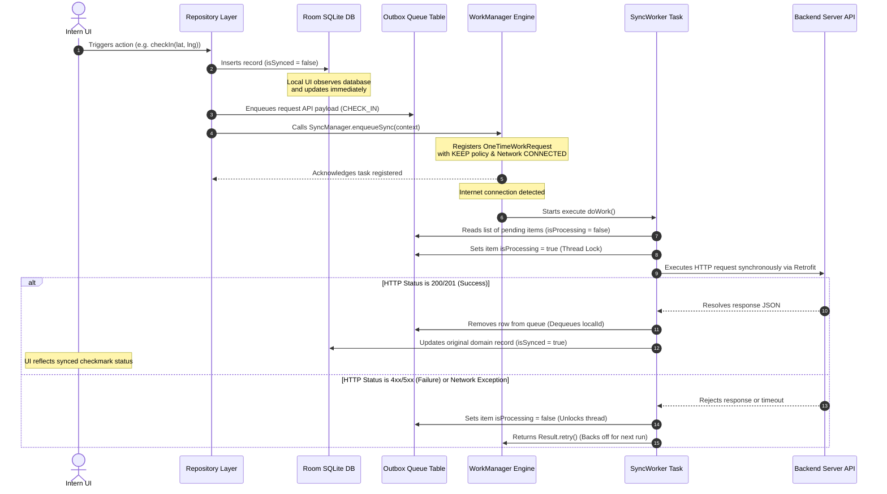

# SWAYOG Employee App: Detailed Intern Workspace & Feature Parity Architecture

This document provides a highly detailed, component-level engineering guide on how the **Intern Workspace**, database states, login operations, geofenced actions, and background sync logic are structured and executed in the **SWAYOG Employee Mobile Application**. It details the structural differences, system behaviors, code signatures, and sequence logic.

---

## 1. System Architecture & Component Interactions

The application uses an **Offline-First Repository Pattern**. Components react to local SQLite state changes via Jetpack Compose and Kotlin Flow. Database changes write transactions to an `outbox_queue` which synchronizes asynchronously in the background via Jetpack `WorkManager`.

```
+--------------------------------------------------------------------------+
|                             JETPACK COMPOSE UI                           |
|       - InternDashboard.kt (Skills, Mentor Info, Shadow Logs Form)       |
|       - LoginScreen.kt (Username & security code credentials fields)     |
+--------------------------------------------------------------------------+
                                     ^
                                     | (Reactive StateFlow / Flows)
                                     v
+--------------------------------------------------------------------------+
|                              VIEWMODEL LAYER                             |
|       - MainViewModel.kt (Handles UI State, submits daily commits)       |
+--------------------------------------------------------------------------+
                                     ^
                                     | (Repository Queries & Mutators)
                                     v
+--------------------------------------------------------------------------+
|                             REPOSITORY LAYER                             |
|       - AttendanceRepository.kt (checkIn, checkOut, submitCommit)        |
|       - UserRepository.kt (Manages logins & Encrypted Session profiles)  |
+--------------------------------------------------------------------------+
          |                                                       |
   (Saves Data first)                                     (Queues requests)
          v                                                       v
+-----------------------------------+                   +------------------+
|      ROOM LOCAL SQLITE CACHE      |                   |   OUTBOX QUEUE   |
|   - attendance_records Table      |                   |   - enqueues     |
|   - daily_commits Table           |                   |     API payloads |
+-----------------------------------+                   +------------------+
                                                                  |
                                                           (Triggers sync)
                                                                  v
                                                        +------------------+
                                                        |   WORKMANAGER    |
                                                        |   - SyncWorker   |
                                                        +------------------+
                                                                  |
                                                             (Retrofit)
                                                                  v
                                                        +------------------+
                                                        |  BACKEND SERVER  |
                                                        +------------------+
```

---

## 2. Database Layer & Position in DB (In-Depth)

Intern roles and tasks are structured across the local SQLite (Room) database and the backend PostgreSQL database.

### A. Local SQLite Entity Declarations (Room DB)

#### 1. Employee Session Metadata ([EmployeeSessionEntity](file:///d:/intrnship/SwayogEmployeeApp/app/src/main/java/com/example/swayogemployeeapp/data/local/entity/EmployeeSessionEntity.kt))
Maintains the logged-in user profile details, credentials tokens, and the user's role mapping.
```kotlin
@Entity(tableName = "employee_session")
data class EmployeeSessionEntity(
    @PrimaryKey val id: String,
    val loginId: String,
    val email: String,
    val name: String,
    val role: String,        // Mapped to "EMPLOYEE"
    val jobRole: String,     // Set exactly to "Intern" in DB
    val employeeCode: String?,
    val reportingManagerId: String?, // Senior Mentor user ID
    val accessToken: String,
    val refreshToken: String,
    val lastSyncTimestamp: Long
)
```

#### 2. Outbox Transaction Queue ([OutboxQueueEntity](file:///d:/intrnship/SwayogEmployeeApp/app/src/main/java/com/example/swayogemployeeapp/data/local/entity/OutboxQueueEntity.kt))
Every mutation performed offline enqueues a transaction record here.
```kotlin
@Entity(tableName = "outbox_queue")
data class OutboxQueueEntity(
    @PrimaryKey(autoGenerate = true) val localId: Long = 0,
    val actionType: String,            // "CHECK_IN", "CHECK_OUT", "COMMIT", "SURVEY"
    val endpoint: String,              // API URL route path
    val payloadJson: String,           // JSON request body serialization
    val localAttachmentPaths: String?, // Comma-separated paths for local PDF/image attachments
    val isProcessing: Boolean = false  // Lock flag for SyncWorker thread safety
)
```

---

## 3. Login Authentication & Session Routing Lifecycle

### A. Dynamic Login Screen Layout ([LoginScreen.kt](file:///d:/intrnship/SwayogEmployeeApp/app/src/main/java/com/example/swayogemployeeapp/ui/screens/LoginScreen.kt))
The user logs in with either their email credentials or via Mobile OTP.
* If **Passcode/Email** mode is active, the app transmits username/email and security passcode parameters.
* If **Mobile OTP** mode is active, the app sends a verification SMS OTP code.

Upon submitting credentials, the screen calls `viewModel.login(username, securityCode, isOtpMode)` which requests the backend authentication endpoint:

```
POST /api/v1/auth/login
```

#### Login Success Payload Example
```json
{
  "success": true,
  "token": "eyJhbGciOiJIUzI1NiIsIn...",
  "refreshToken": "d8a1b2c3d4e5...",
  "user": {
    "id": "usr-8a2b-9c3d",
    "name": "Arjun Sharma",
    "email": "arjun.s@swayog.com",
    "role": "EMPLOYEE",
    "jobRole": "Intern",
    "reportingManagerId": "usr-9283-mentor"
  }
}
```

### B. Session Save & Screen Composition Navigation ([DashboardRouter.kt](file:///d:/intrnship/SwayogEmployeeApp/app/src/main/java/com/example/swayogemployeeapp/ui/screens/DashboardRouter.kt))
1. When the API response resolves, [UserRepository.kt](file:///d:/intrnship/SwayogEmployeeApp/app/src/main/java/com/example/swayogemployeeapp/data/repository/UserRepository.kt) parses the tokens and user parameters, saving them into [EmployeeSessionEntity](file:///d:/intrnship/SwayogEmployeeApp/app/src/main/java/com/example/swayogemployeeapp/data/local/entity/EmployeeSessionEntity.kt) inside Room.
2. The UI collects this session state. The [DashboardRouter.kt](file:///d:/intrnship/SwayogEmployeeApp/app/src/main/java/com/example/swayogemployeeapp/ui/screens/DashboardRouter.kt) evaluates the session:
```kotlin
@Composable
fun DashboardRouter(viewModel: MainViewModel) {
    val sessionState by viewModel.session.collectAsState()
    val session = sessionState ?: return LoadingScreen()

    when (session.jobRole) {
        "Intern" -> InternDashboard(viewModel) // Loads the specialized Intern workspace panel
        "Site Survey Engineer" -> SurveyDashboard(viewModel)
        "Solar Design Engineer" -> DesignDashboard(viewModel)
        // ... other roles
    }
}
```

---

## 4. Geofencing Coordinates Validation Flow

Geofenced attendance verification processes coordinates checks locally on the device prior to sending checking transactions.

```
[User presses Check-In]
          |
          v
[Request Location Services GPS]
          |
          v
[Retrieve target site coordinate pins]
          |
          v
[Run Haversine Distance Equation]
          |
    (Distance <= 100m)
          +---> Yes -> Insert local AttendanceRecordEntity -> Enqueue Outbox CHECK_IN -> Sync
          |
          +---> No  -> Block action, show warning "You are outside the geofence boundary!"
```

### Geofencing Distance Equation Details
The app computes the great-circle distance between the current location $(lat_1, lng_1)$ and the target site location $(lat_2, lng_2)$ using the **Haversine formula**:

$$d = 2R \arcsin\left(\sqrt{\sin^2\left(\frac{\Delta lat}{2}\right) + \cos(lat_1) \cos(lat_2) \sin^2\left(\frac{\Delta lng}{2}\right)}\right)$$

Where $R = 6371000$ meters (Earth's radius).

```kotlin
fun calculateDistanceInMeters(
    lat1: Double, lon1: Double,
    lat2: Double, lon2: Double
): Double {
    val r = 6371000.0 // Earth radius in meters
    val dLat = Math.toRadians(lat2 - lat1)
    val dLon = Math.toRadians(lon2 - lon1)
    val a = Math.sin(dLat / 2) * Math.sin(dLat / 2) +
            Math.cos(Math.toRadians(lat1)) * Math.cos(Math.toRadians(lat2)) *
            Math.sin(dLon / 2) * Math.sin(dLon / 2)
    val c = 2 * Math.atan2(Math.sqrt(a), Math.sqrt(1 - a))
    return r * c
}
```

* **GPS Validation Constraint**: If the computed distance is $> 100.0$ meters, check-in is rejected, and an alert is shown.
* **Outbox Logging**: On success, [AttendanceRepository.kt](file:///d:/intrnship/SwayogEmployeeApp/app/src/main/java/com/example/swayogemployeeapp/data/repository/AttendanceRepository.kt) saves the record as `isSynced = false` in `attendance_records` and enqueues the `CHECK_IN` action to the outbox queue.

---

## 5. Daily Shadow Log & Work Commits Pipeline

Interns record daily learning achievements via the Shadow Log interface.

```
[Intern UI inputs Achievements, Category, Hours]
                        |
                        v
        [viewModel.submitDailyWork()]
                        |
                        v
   [AttendanceRepository.submitDailyWorkCommit()]
                        |
                        v
        +---------------+---------------+
        |                               |
        v                               v
[Insert DailyCommitEntity]    [Enqueue Outbox COMMITS]
(Local state updates)         (Json serialized data)
        |                               |
        v                               v
[Compose List displays log]   [SyncManager.enqueueSync()]
                              (Launches SyncWorker)
```

### Flow Walkthrough

1. **User Submission**: The intern fills in `achievementsText` and logs decimal work hours (e.g., `6.5`). They select a shadow category (e.g., `Site Surveying`).
2. **ViewModel Operations**: Clicking **Submit Shadow Log** fires:
   ```kotlin
   viewModel.submitDailyWork(
       title = "Shadowing Log: Site Surveying",
       description = achievementsText,
       hours = hoursSpent,
       taskId = "intern_shadow"
   )
   ```
3. **Repository Persistence**: [AttendanceRepository.kt](file:///d:/intrnship/SwayogEmployeeApp/app/src/main/java/com/example/swayogemployeeapp/data/repository/AttendanceRepository.kt) handles writing to the DB:
   * Inserts [DailyCommitEntity](file:///d:/intrnship/SwayogEmployeeApp/app/src/main/java/com/example/swayogemployeeapp/data/local/entity/DailyCommitEntity.kt) with `isSynced = false`.
   * Formulates a `WorkSubmissionRequest` data payload.
   * Serializes the request payload to JSON and inserts it into [OutboxQueueEntity](file:///d:/intrnship/SwayogEmployeeApp/app/src/main/java/com/example/swayogemployeeapp/data/local/entity/OutboxQueueEntity.kt) with an action type of `"COMMIT"`.
4. **Sync Schedule**: Calls `SyncManager.enqueueSync(context)` to process background uploads.

---

## 6. Offline Synchronization & Execution (WorkManager Engine)

Synchronization handles offline tasks through background execution blocks controlled by Jetpack `WorkManager`.

### A. SyncWorker Processing Loop ([SyncWorker.kt](file:///d:/intrnship/SwayogEmployeeApp/app/src/main/java/com/example/swayogemployeeapp/data/sync/SyncWorker.kt))
When network access is established, the WorkManager schedules [SyncWorker.kt](file:///d:/intrnship/SwayogEmployeeApp/app/src/main/java/com/example/swayogemployeeapp/data/sync/SyncWorker.kt) to execute `doWork()`:

1. **Queue Retrieval**: Reads all elements in [OutboxQueueEntity](file:///d:/intrnship/SwayogEmployeeApp/app/src/main/java/com/example/swayogemployeeapp/data/local/entity/OutboxQueueEntity.kt) where `isProcessing = false` ordered by chronological primary key `localId`.
2. **Thread Locking**: Marks the working element's status as `isProcessing = true` to prevent double-execution collisions.
3. **Action Routing**: Evaluates the transaction action type and performs the equivalent REST call:
   * **`CHECK_IN` / `CHECK_OUT`**: Sends geofenced attendance logs. On HTTP `200 OK`, sets the target record's database flags to `isSynced = true`.
   * **`COMMIT`**: Sends shadow logs and work summaries.
   * **`SURVEY` / `DESIGN`**: Encodes text metadata parameters alongside file streams using Retrofit's `@Multipart` payload constructs (`MultipartBody.Part`).
4. **Dequeueing**: Upon successful completion, the outbox record is removed from `outbox_queue`. If a temporary network drop or server-side internal error ($5xx$) occurs, the process locks are released (`isProcessing = false`) and the worker signals a retry state.

---

## 7. Interactive UI & Feedback Interfaces

### A. Practical Skills Checklist Tracker
The skills checklist provides visual tracking of the intern's learning progression.
```kotlin
// Checked items represent completed tasks tracked in the intern's profile
Row(verticalAlignment = Alignment.CenterVertically) {
    Checkbox(
        checked = skillSurvey,
        onCheckedChange = { skillSurvey = it },
        colors = CheckboxDefaults.colors(checkedColor = PrimaryAmber)
    )
    Text("Surveying (Rooftops & Shading checks)", color = NeutralText)
}
```
Checking a skill records an immediate update to the local profile configurations, which syncs back to the supervisor’s dashboard metrics.

### B. Supervisor Ratings Feed
Ratings and supervisor comments are retrieved dynamically from the backend and cached inside Room.
```kotlin
supervisorFeedback.forEach { feed ->
    Card(colors = CardDefaults.cardColors(containerColor = SurfaceDark)) {
        Column(modifier = Modifier.padding(12.dp)) {
            Row(modifier = Modifier.fillMaxWidth(), horizontalArrangement = Arrangement.SpaceBetween) {
                Text(feed.mentor, color = NeutralText, fontWeight = FontWeight.Bold)
                Text(feed.score, color = SuccessGreen, fontWeight = FontWeight.Bold) // e.g. "4.5/5.0"
            }
            Text(feed.comment, fontSize = 12.sp, color = MutedText)
        }
    }
}
```
This loop ensures the intern has clear, structured visibility into supervisor review comments, grades, and mentoring checkmarks.

---

## 8. In-Depth Database Synchronization Engine

This section details how synchronization operates between the SQLite cache on the Android device and the PostgreSQL backend database.

### A. The End-to-End Sync Sequence

The timeline below details how local modifications are cached first, enqueued, and eventually processed by background workers.



### B. Network Constraints & Worker Registration ([SyncManager.kt](file:///d:/intrnship/SwayogEmployeeApp/app/src/main/java/com/example/swayogemployeeapp/data/sync/SyncManager.kt))

Work scheduling enforces system-level constraints to prevent battery drain and excessive data consumption.

```kotlin
object SyncManager {
    fun enqueueSync(context: Context) {
        // Enforce active internet connectivity constraint
        val constraints = Constraints.Builder()
            .setRequiredNetworkType(NetworkType.CONNECTED)
            .build()
        
        // Define one-time execution worker request
        val syncRequest = OneTimeWorkRequestBuilder<SyncWorker>()
            .setConstraints(constraints)
            .build()
            
        // Enqueue Unique Work to avoid race conditions and double requests
        WorkManager.getInstance(context).enqueueUniqueWork(
            "SwayogSyncWork",
            ExistingWorkPolicy.KEEP, // Retain existing task, reject duplicate schedules
            syncRequest
        )
    }
}
```

### C. Processing Loop Details ([SyncWorker.kt](file:///d:/intrnship/SwayogEmployeeApp/app/src/main/java/com/example/swayogemployeeapp/data/sync/SyncWorker.kt))

The background sync worker runs sequentially in the background:

    - If an API request returns successful results (status code 2xx), the queue record is dequeued, and the local table (e.g. `attendance_records` or `daily_commits`) is updated to mark `isSynced = true` and record remote keys.
    - If the request fails due to backend timeouts or status codes 4xx/5xx, `isProcessing` is reset to `false`. Worker returns `Result.retry()` which reschedules sync with exponential backoff constraints.

---

## 9. Comprehensive UI & Implementation Blueprints for all 9 Dashboards

Below are the detailed, screen-by-screen specifications, parameter states, layout details, and operations for each of the 9 role-specific workspaces in the Swayog Employee Android Application. Use these details as a blueprint for implementing the Jetpack Compose components.

---

### 1. Service Coordinator Dashboard ([CoordinatorDashboard.kt](file:///d:/intrnship/SwayogEmployeeApp/app/src/main/java/com/example/swayogemployeeapp/ui/screens/CoordinatorDashboard.kt))

#### A. Layout & UI Blueprint
```
+-----------------------------------------------------------------------+
|  [Search customer name or code...] -> OutlinedTextField               |
|  [All Cities]  [Mumbai]  [Delhi]  [Pune]  -> Horizontal Tabs Row      |
+-----------------------------------------------------------------------+
| SELECTED CUSTOMER INFO                | LIVE INVERTER GENERATION      |
| Code: SW-101                          | [Bolt Icon] 3.2 kW            |
| Name: John Doe                        | Daily Yield: 18.4 kWh         |
| Size: 5.4 kW                          |                               |
| Brand: Growatt                        |                               |
| Status: [Online Badge]                | [REFRESH TELEMETRY] (Flucts)  |
+-----------------------------------------------------------------------+
| [EDIT INVERTER CREDENTIALS]           | [ASSIGN FIELD CREW TASK]      |
+-----------------------------------------------------------------------+
| CUSTOMER DIRECTORY (Filtered Results List)                            |
| - John Doe (SW-101 • Mumbai)                              [5.4 kW]    |
| - Jane Smith (SW-204 • Delhi)                             [10.0 kW]   |
+-----------------------------------------------------------------------+
```

#### B. Component States & Variables
* `searchQuery` (`MutableState<String>`): Filter key matching customer name/code.
* `selectedCity` (`MutableState<String>`): Filter matching `city` (default: `"All Cities"`).
* `selectedCustomer` (`MutableState<MockCustomer>`): Binds to the info panel when clicking on directory items.
* `liveGeneration` / `dailyYield` (`MutableState<Double>`): Simulated inverter metrics.
* `showCredentialsModal` / `showAssignModal` (`MutableState<Boolean>`): Popup controllers.

#### C. Modals & Actions
1. **Credentials Manager Modal**:
   * *Inputs*: API Login ID, API Password, Datalogger Serial Number (SN).
   * *Action*: Simulates connectivity verification and enqueues credentials to the sync outbox.
2. **Assign Task Modal**:
   * *Inputs*: Job Type dropdown (`"Survey"`, `"Complaint"`, `"AMC Visit"`, `"Service"`), Customer Name, Description, Address.
   * *Action*: Inserts a new task locally into the local Room database (`employee_tasks` table) by calling `viewModel.assignTaskLocally()`. This dynamically updates other local dashboards for testing.

---

### 2. Site Survey Engineer Dashboard ([SurveyDashboard.kt](file:///d:/intrnship/SwayogEmployeeApp/app/src/main/java/com/example/swayogemployeeapp/ui/screens/SurveyDashboard.kt))

#### A. Layout & UI Blueprint
```
+-----------------------------------------------------------------------+
| [Back Arrow] SITE SURVEY REPORT (TASK-101)                            |
+-----------------------------------------------------------------------+
| 1. GPS GEOFENCE MATCHING                                              |
| Target: 19.1234, 72.8901                                              |
| Status: [Locked / Verified Green]             [MATCH GPS COORDINATES] |
+-----------------------------------------------------------------------+
| 2. ROOFTOP DIMENSIONS INTAKE                                          |
| Length (ft): [ 45 ]                           Width (ft): [ 30 ]      |
| Material: [Concrete] [Tin Sheet] [Asbestos] [Ground Mount] (Row Selector) |
+-----------------------------------------------------------------------+
| 3. SHADING FACTORS & OBSTACLES                                        |
| [x] Trees nearby      [ ] Buildings     [x] Towers     [x] Cables     |
| Obstacle Notes: [parapet wall & chimneys on SW corner...]            |
+-----------------------------------------------------------------------+
| 4. COMPRESSED IMAGE UPLOADER (Requires min 4 photos)                  |
| [Camera Icon] 4 Photos Captured & Compressed (Jpeg 75%)               |
| Logs: Photo 4: rescaled to 1280px (240 KB). Check!       [TAKE PHOTO] |
+-----------------------------------------------------------------------+
| [SUBMIT SITE REPORT] (Enabled only when GPS & 4 photos verified)      |
+-----------------------------------------------------------------------+
```

#### B. Component States & Variables
* `lengthStr` / `widthStr` (`MutableState<String>`): Rooftop dimensions inputs.
* `selectedRoofType` (`MutableState<String>`): Choice field from available materials.
* `shadeTrees`/`shadeBuildings`/`shadeTowers`/`shadeCables` (`MutableState<Boolean>`): Checklist flags.
* `gpsVerified` (`MutableState<Boolean>`): Locks only when user runs location matches.
* `mockPhotosCount` (`MutableState<Int>`): Photo uploads counter constraints.

#### C. Operations
* **Recommended Capacity Calculation**: Auto-computes recommended Solar Capacity (kW) on submission using:
  $$\text{Capacity (kW)} = \frac{\text{length} \times \text{width}}{250.0}$$
* **Submission Sequence**: Bundles form records and triggers:
  `viewModel.submitSurvey(...)`.
  Updates task state to completed, and enqueues survey payload to `outbox_queue`.

---

### 3. Solar Design Engineer Dashboard ([DesignDashboard.kt](file:///d:/intrnship/SwayogEmployeeApp/app/src/main/java/com/example/swayogemployeeapp/ui/screens/DesignDashboard.kt))

#### A. Layout & UI Blueprint
```
+-----------------------------------------------------------------------+
| [Back Arrow] DRAFTING WORKSPACE: Jane Smith                           |
+-----------------------------------------------------------------------+
| DOWNLOADED SITE SURVEY SUMMARY                                        |
| Dimensions: 45.0 ft x 30.0 ft (Concrete)                              |
| Obstacles: Trees to SW                                                |
| Suggested Capacity: 5.4 kW                                            |
+-----------------------------------------------------------------------+
| ENTER SYSTEM DESIGN PARAMETERS                                        |
| Structural Tilt Angle (Degrees): [ 15.0 ]                             |
| Panel Count & Model: [ 12 Panels (Mono PERC 450W) ]                   |
| Inverter Model: [ Growatt 5000TL3-S ]                                 |
| Cable / Wiring Specs: [ 4sqmm DC Solar Cables, 32A AC MCB ]           |
+-----------------------------------------------------------------------+
| UPLOAD CAD & SLD LAYOUT DRAWINGS                                      |
| - CAD Structural Drawing (.dwg/.pdf): cad_layout_Jane.dwg    [ATTACH] |
| - Single Line Diagram SLD (.pdf): sld_diagram_Jane.pdf        [ATTACH] |
+-----------------------------------------------------------------------+
| DESIGN REVIEW PIPELINE: [Survey X] -> [Drafting X] -> [SC] -> [Apprv] |
+-----------------------------------------------------------------------+
| [SUBMIT DESIGN BUNDLE] (Enabled when both drawings attached)          |
+-----------------------------------------------------------------------+
```

#### B. Component States & Variables
* `tiltAngle` (`MutableState<String>`): Panel mounting structural slope angle.
* `panelBrandCount` (`MutableState<String>`): Model metadata properties.
* `cadFileAttached` / `sldFileAttached` (`MutableState<String?>`): File name variables.

#### C. Operations
* **Attachment Handling**: Simulates selecting documents. Clicking "Attach" binds mock file names to the workspace variables.
* **Submission Sequence**: Fires `viewModel.submitDesign(...)`.
  Encodes structural parameters, enqueues drawing binary parts parameters, and schedules Outbox sync.

---

### 4. Electrical Engineer Dashboard ([ElectricalDashboard.kt](file:///d:/intrnship/SwayogEmployeeApp/app/src/main/java/com/example/swayogemployeeapp/ui/screens/ElectricalDashboard.kt))

#### A. Layout & UI Blueprint
```
+-----------------------------------------------------------------------+
| [Back Arrow] COMMISSIONING CHECKS: TASK-201                           |
+-----------------------------------------------------------------------+
| SINGLE LINE DIAGRAM (SLD) VECTOR INSPECTOR                            |
|  [PV Array Block] ===DC Fuse===> [Inverter] ===AC Cable===> (Meter)   |
|  (Renders lines, blocks, and indicators dynamically via Android Canvas) |
+-----------------------------------------------------------------------+
| AC/DC COMPLIANCE TESTING CHECKLIST                                    |
| [x] AC Cable Megger insulation test checked                           |
| [x] Inverter Grounding earthing resistance verified (<2 Ohm)          |
| [ ] Solar Net-Meter installation verified                             |
| [ ] ACDB/DCDB surge protection checked                                |
+-----------------------------------------------------------------------+
| MEASURED SYSTEM VALUES                                                |
| Earthing Pit Resistance (Ohms): [ 1.8 ]                               |
| DC Open Circuit Voc (V): [ 480 ]              AC Voltage (V): [ 232 ] |
| Net Meter Serial ID No.: [ NM-98273612-B ]                            |
+-----------------------------------------------------------------------+
| AUDITED COMMISSIONING REPORT DOCUMENT                                 |
| [Scanner Icon] commissioning_201_signed.pdf                    [SCAN] |
+-----------------------------------------------------------------------+
| [SUBMIT COMMISSIONING FOR AUDIT] (Enabled when scan and checks OK)   |
+-----------------------------------------------------------------------+
```

#### B. Component States & Variables
* `earthingResistance` (`MutableState<String>`): Grounding check values.
* `dcVocVoltage` / `acVoltageLine` (`MutableState<String>`): Grid metrics.
* `netMeterNo` (`MutableState<String>`): Serial registration codes.
* `checkedMegger`/`checkedGrounding`/`checkedNetMeter`/`checkedSurge` (`MutableState<Boolean>`): Compliance flags.
* `scanDocumentAttached` (`MutableState<String?>`): File path parameter.

#### C. Canvas Drawing Specifications
Renders the custom electrical Single Line Diagram (SLD) dynamically inside Compose using a `Canvas` layout drawing blocks (Rectangles for arrays/inverter, circle for net-meter, and connecting lines for lines phase routing).

---

### 5. Inventory Executive Dashboard ([InventoryDashboard.kt](file:///d:/intrnship/SwayogEmployeeApp/app/src/main/java/com/example/swayogemployeeapp/ui/screens/InventoryDashboard.kt))

#### A. Layout & UI Blueprint
```
+-----------------------------------------------------------------------+
| [!] CRITICAL STOCK ALERTS                                             |
| - Galvanized Structure Brackets is low in stock: 3 left!              |
+-----------------------------------------------------------------------+
| [SCAN QR / BARCODE]                   | [DISPATCH DESK] (Order lists) |
+-----------------------------------------------------------------------+
| ACTIVE STOCK LEDGER (Offline Caching Active)                          |
| - Mono PERC 450W Solar Panels (Module • HASH_PANEL_MONO)   [124 Units] |
| - Growatt 5000TL3-S Inverter (Inverter • HASH_INV_GWT)      [12 Pcs]   |
| - Galvanized Solar Brackets (Structure • HASH_STRUCT)       [3 Sets]   |
+-----------------------------------------------------------------------+
```

#### B. Modals & Actions
1. **Adjust Stock Dialog**:
   * Triggered by clicking any item in the ledger. Displays an OutlinedTextField allowing manual entry modifications of stock levels.
2. **Barcode Scanner Simulator Dialog**:
   * Opens camera mockup interface. Pressing "Mock Scan Code" mimics datalogger scanning checks and outputs:
     `SWAYOG-GWT-5000-TL3-982736`
3. **Dispatch Desk Dialog**:
   * Displays materials orders dispatched by Service Coordinators.
   * Pressing `RELEASE` deducts the corresponding quantities from inventory ledger stocks.

---

### 6. O&M Technician Dashboard ([MaintenanceDashboard.kt](file:///d:/intrnship/SwayogEmployeeApp/app/src/main/java/com/example/swayogemployeeapp/ui/screens/MaintenanceDashboard.kt))

#### A. Layout & UI Blueprint
```
+-----------------------------------------------------------------------+
| [Back Arrow] AMC PANEL CLEANING CHECK                                 |
+-----------------------------------------------------------------------+
| OPTIMIZED ROUTE MAP DIRECTIONS                            [NAVIGATE]  |
+-----------------------------------------------------------------------+
| REQUIRED AUDIT PHOTOS (WATERMARKED)                                   |
| +-----------------------------------+ +-----------------------------+ |
| | [Camera] TAKE BEFORE (DIRTY)      | | [Camera] TAKE AFTER (CLEAN) | |
| | (Lat: 19.12 • Jun 19 2026)        | | (Lat: 19.12 • Jun 19 2026)  | |
| +-----------------------------------+ +-----------------------------+ |
+-----------------------------------------------------------------------+
| AMC AUDIT INSPECTION LIST                                             |
| [ ] Dust layer completely washed and dried                            |
| [ ] Checked structural clamps for physical looseness                  |
| [ ] Visual check for micro-cracks/hot spots                           |
| [ ] Site water pressure and availability verified                     |
+-----------------------------------------------------------------------+
| [COMPLETE AMC CLEANING VISIT] (Enabled when before/after photos taken)|
+-----------------------------------------------------------------------+
```

#### B. Component States & Variables
* `checkedDustClean` / `checkedClampsTight` / `checkedCableInspect` / `checkedWaterPress` (`MutableState<Boolean>`): AMC checklist.
* `beforePhoto` / `afterPhoto` (`MutableState<String?>`): Photo path references.

#### C. Operations
* **Navigate CTA**: Constructs standard navigation intents launching external Google Maps routing.
* **Photo Watermarking**: Mocks geo-watermarking active latitude/longitude coordinate decimals and timestamp data strings on the images prior to queue sync.

---

### 7. Service Engineer Dashboard ([ServiceDashboard.kt](file:///d:/intrnship/SwayogEmployeeApp/app/src/main/java/com/example/swayogemployeeapp/ui/screens/ServiceDashboard.kt))

#### A. Layout & UI Blueprint
```
+-----------------------------------------------------------------------+
| [Back Arrow] RESOLVE COMPLAINT: TICKET #401                           |
+-----------------------------------------------------------------------+
| 1. OFFLINE DIAGNOSTIC DIRECTORY MANUAL                                |
| [ Search error code... e.g. 117                     ]  [Search Icon]  |
| Info Code 117: PV Voltage High. Check series string size and Voc.     |
+-----------------------------------------------------------------------+
| 2. SERVICE & PARTS RECORD                                             |
| Spares Consumed: [None] [MC4 Connector] [32A AC MCB] [PV Fuse 15A]     |
| Work Done: [Reconfigured series string array config to reduce Voc...] |
+-----------------------------------------------------------------------+
| 3. CLIENT DIGITAL SIGNATURE SIGN-OFF                                  |
| +-------------------------------------------------------------------+ |
| | (Intern signature path drawing canvas)                            | |
| | Draw customer signature here...                       [CLEAR Icon]| |
| +-------------------------------------------------------------------+ |
+-----------------------------------------------------------------------+
| [SOLVE & CLOSE COMPLAINT TICKET] (Enabled when signed and work filled)|
+-----------------------------------------------------------------------+
```

#### B. Component States & Variables
* `errorSearchQuery` (`MutableState<String>`): Diagnostics lookup codes.
* `selectedSparePart` (`MutableState<String>`): Spares consumed selector.
* `workDoneText` (`MutableState<String>`): Repair description.
* `signaturePaths` (`SnapshotStateList<Path>`): Accumulates coordinates when drawing.

#### C. Operations
* **Diagnostic Code Directory**: Offline map resolving code lookups:
  * `117` -> PV Voltage High (check Voc).
  * `120` -> Inverter Over-temperature (check fans).
  * `301` -> AC Grid Out of Range (check phase/voltage).
* **Signature pad Canvas**: Employs dragging gestures detection (`detectDragGestures`) to map user finger traces to a drawing path array.

---

### 8. Monitoring Analyst Dashboard ([MonitoringDashboard.kt](file:///d:/intrnship/SwayogEmployeeApp/app/src/main/java/com/example/swayogemployeeapp/ui/screens/MonitoringDashboard.kt))

#### A. Layout & UI Blueprint
```
+-----------------------------------------------------------------------+
| [Back Arrow] DIAGNOSTIC & DISPATCH ACTION                             |
+-----------------------------------------------------------------------+
| ALERTS METRICS DETAIL                                                 |
| Customer: SW-101 (John Doe)                                           |
| Title: Generation Drop > 20%                                          |
| Desc: Expected 18.4 kWh. Actual 12.1 kWh. Peak sunlight.              |
+-----------------------------------------------------------------------+
| REGIONAL IRRADIANCE API INTEGRATION                                   |
| Telemetry API Status: [ACTIVE Green]                                  |
| Ground Irradiance: 840 W/m² (Peak sunlight)                           |
| Efficiency Yield Ratio: 64% (ALERT)                                   |
+-----------------------------------------------------------------------+
| DIRECT WIDGET ACTIONS                                                 |
| - Pre-configured WhatsApp Outage templates:                           |
|   [SEND PRE-FILLED WHATSAPP OUTAGE NOTIFICATION]                      |
|                                                                       |
| - Dispatch O&M cleaning / repair technician:                          |
|   [AUTO DISPATCH CREW TO SITE]                                        |
+-----------------------------------------------------------------------+
```

#### B. Operations
* **WhatsApp Outage template**: Connects client to simulated SMS/WhatsApp dispatch templates API notifying customers.
* **Auto Dispatch Crew**: Automatically maps the alert properties to construct a new `AMC Visit` / `Complaint` task locally inside Room database (`employee_tasks`) to deploy technicians.

---

### 9. Intern Dashboard ([InternDashboard.kt](file:///d:/intrnship/SwayogEmployeeApp/app/src/main/java/com/example/swayogemployeeapp/ui/screens/InternDashboard.kt))

#### A. Layout & UI Blueprint
```
+-----------------------------------------------------------------------+
| ASSIGNED SENIOR MENTOR                                                |
| [School Icon] Rajesh Kumar (Senior Design Eng)                        |
+-----------------------------------------------------------------------+
| DAILY LEARNING SHADOW LOGS                                            |
| Shadow Category: [Site Surveying] [Layout CAD Drafting] [Repair Service] |
| Achievements: [shadowed measurements parameters checks on flat roof...] |
| Hours Spent: [ 6.5 ]                                                  |
|                                                  [SUBMIT SHADOW LOG]  |
+-----------------------------------------------------------------------+
| FIELD SKILLS TIMELINE TRACKER (Milestones checklist)                  |
| [x] Surveying (Rooftops & Shading)  [ ] CAD Design Layout checks      |
| [ ] Commissioning Pit checks        [x] Diagnostic Inverter repairs   |
+-----------------------------------------------------------------------+
| SUPERVISOR RATING & COMMENTS FEED                                     |
| - Rajesh Kumar (4.5/5.0): Great measurements checks.                  |
| - Sanjay Mehta (4.0/5.0): Review Single Line Diagrams.                |
+-----------------------------------------------------------------------+
```

#### B. Component States & Variables
* `mentorName` / `shadowTaskType` (`MutableState<String>`): Internship indicators.
* `achievementsText` / `hoursSpentStr` (`MutableState<String>`): Work inputs.
* `skillSurvey`/`skillDesign`/`skillComm`/`skillRepair` (`MutableState<Boolean>`): Checklist checks.

#### C. Operations
* **Shadow Log Submission**: Validates hours spent format, inserts daily log into local Room, enqueues `"COMMIT"` data payload to outbox queue, and calls sync background actions.

